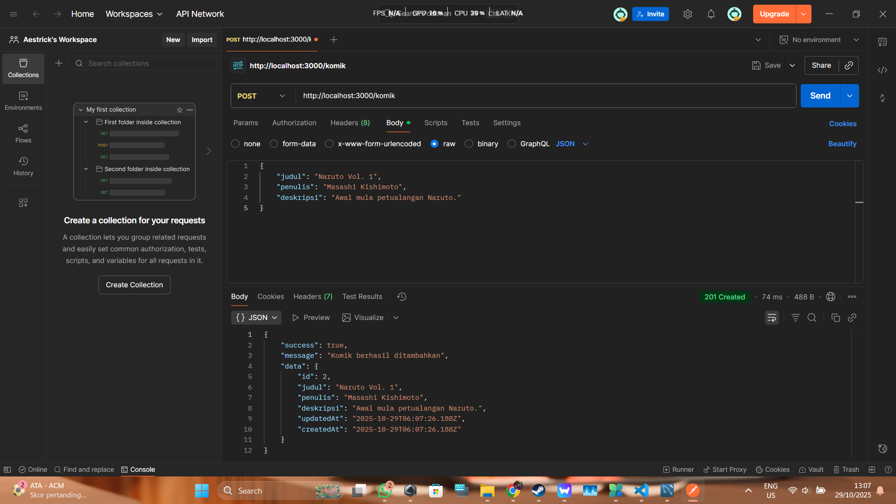
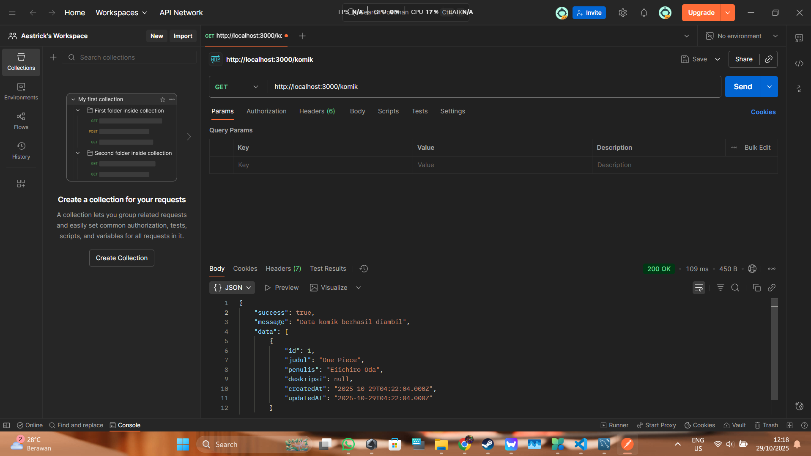
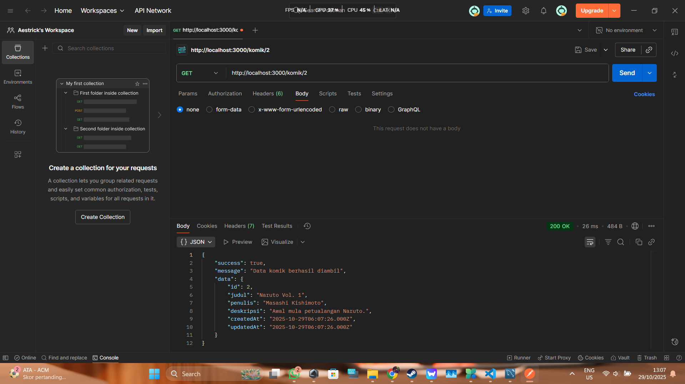
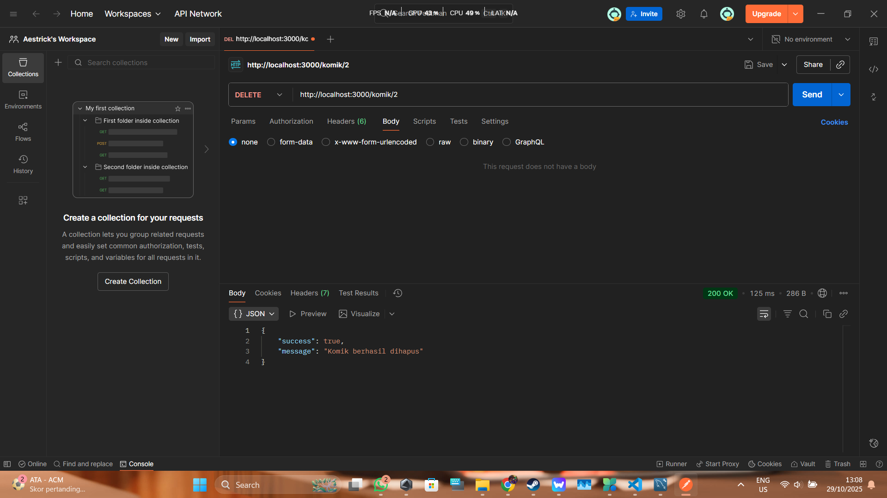

# Praktikum 4 - ORM dengan Sequelize & MySQL

Ini adalah proyek web service API untuk mengelola data komik. Proyek ini dibuat menggunakan Express.js dan terhubung ke database MySQL menggunakan Sequelize sebagai ORM.

## Database
- **Database:** `orm`
- **Tabel:** `komik`

## Hasil Pengujian Postman

Berikut adalah bukti pengujian untuk setiap endpoint API.

### 1. CREATE (POST /komik)
*Berhasil menambahkan data komik baru.*

### 2. READ All (GET /komik)
*Berhasil mengambil semua data komik.*

### 3. READ by ID (GET /komik/:id)
*Berhasil mengambil data komik spesifik.*

### 4. UPDATE (PUT /komik/:id)
*Berhasil mengubah data komik.*

### 5. DELETE (DELETE /komik/:id)
*Berhasil menghapus data komik.*
